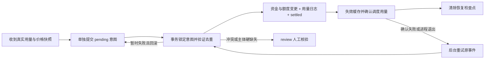

# 计费完整性修复规范与验收记录

日期：2026-10-07。基线：XY2API `9717116f198904442ebb400d7d06792a40dea15c`（产品 0.2.2，完整兼容 Sub2API 0.2.8）。本文随实现和实际测试结果更新；没有验证的项目不得标记完成。

## 1. 事故依据与范围

已读取会话 `07a85d02-a864-4dc9-9ea4-baed05bf0f23` 全部 91 条活动，并复核本机只读审计材料。生产审计发现 60 个用户、16,744 条有正用量但实扣为零的记录，其中 16,743 次结算报 API_KEY_NOT_FOUND，1 次报 USER_NOT_FOUND。按旧日志价格字段估计待核金额约 $3,014.661012245；这不是已确认损失，也不是可直接执行的补扣金额。会话末尾已处置相关账号，本文不重复处置。

确定根因：上游完成后，结算事务先扣余额，再更新 Key 配额；Key 在途中被软删除时后者返回 NotFound，整个事务回滚。之后服务把日志 ActualCost 改为零，且没有耐久重试。鉴权撤销与既有债务结算被错误绑定。删除用户、套餐、分组及上游账号存在同类风险。

额外缺口：普通文本计费可被工作池 drop/sample 丢弃；扣款与用量日志分开提交；失败日志与免费日志混淆；队列/进程故障缺少恢复凭据；并发请求只检查余额快照。旧 `billing_usage_entries` 没有业务写入，不能作为已扣款证据。客户端 X-Client-Request-ID 已由服务器重建，不把“客户端任意 ID 可免单”列为已证实漏洞。

范围包括本地代码、迁移、回归测试、来源清单及部署/对账操作规范。生产补扣、解封、部署、发布需要独立执行；本轮不执行生产数据变更。

## 2. 官方版本与选择性移植

官方仓库：<https://github.com/Wei-Shaw/sub2api>。实时核验最新发布为 0.2.14（2026-10-07 UTC），固定提交 `0363b8cdba8cec3e2ba4b2dbd49c4481143fa55d`（附注标签对象 `1400a7b482974d98db5b284a8b2afbe3eaf9aaef`）。调研覆盖 0.2.9–0.2.14，三方影响报告使用仓库 upstream-sync 工具生成。此次仅移植计费相关修复，UPSTREAM_BASE 与完整兼容版本保持原义。

| 版本/提交 | 官方修复 | 本地处理原则 |
| --- | --- | --- |
| 0.2.13 / c2d5bbd9 | 删除 Key 后在途费用仍结算 | 引入同类回归，扩展到用户/套餐等生命周期 |
| 0.2.14 / d1aac6b9 | EasyPay 下单签名复用伪造回调 | 白名单回调参数，清理 return URL query，验证攻击与合法回调 |
| 0.2.11 / 43f88c99、52c123e6、652a7d74、b886fb8e | 在途余额预留、定价估算、续租与异步结算交接 | 核验所有入口及 XY 自有逻辑；预留是并发风险控制，不能宣称严格零透支 |
| 0.2.11 / 9ecb3408 | Key 数量、创建频率限制，删除不能清除频控 | 保留撤销自由，防止反复创建/删除绕过限额 |
| 0.2.9 / a2007db7 | 图片价格未配置与显式零价区别 | nil 继承、零为免费，不得混淆 |
| 0.2.9 / fd7af1d4 | 账号成本长上下文开关独立于售价 | 保留 XY 定价时刻及渠道规则 |
| 0.2.10 / b13200d7、ece1eccc、0416c9ed | 流式 usage 透传、缓存 token 归一化 | 依赖顺序移植，覆盖尾帧/缓存边界 |
| 0.2.9 / 1d126c83、3c5ea297 | 搜索成功条件、FreeFast 免费日志 | 错误/未完成不能凭请求猜搜索费用；合法免费不得补扣 |
| 0.2.12 / cf19f30d | 匿名订单核验缺少频控 | 查询入口按 IP 限速，保留正常订单查询 |
| 0.2.9 / 11ffee55 | OpenRouter 精确模型别名识别 | 补齐原有定价别名回归，避免落入错误价格 |

充值奖励、Typesafe 等新功能不属于此次漏洞修复。另核对 `b5b5f1f9` 的模型广场视频倍率展示修复：本地实际视频结算已有独立倍率及回归，展示功能不纳入本轮资金结算补丁。精确文件、提交、移植偏差见来源清单；不可把整个新版本文件覆盖本地定制。

## 3. 必须满足的不变量

1. **鉴权与结算分离**：撤销 Key/用户阻止新请求；已经被接受并发生的用量仍按当时用户、Key、套餐、账号、价格快照结算，不恢复账号状态。硬删除导致主体确实缺失时保留失败凭据，不能声称成功或擅自换付费主体。
2. **一次资金事件只扣一次**：服务器请求 ID + Key ID + 不可变指纹；相同事件可重试，内容冲突必须拒绝。兼容现有及归档去重记录，不改变历史指纹算法。
3. **金额一致**：所有金额必须有限、非负，统一 NUMERIC(20,8) 的舍入；余额、额度与实扣日志一致。输入异常拒绝，不能将 NaN/Infinity 写入账本。
4. **可恢复提交**：冻结命令和完整用量快照先耐久化；资金、额度、去重凭据、成功用量与任务状态在同一 PostgreSQL 事务提交。失败保留 pending/review，不改成“已免费”；重试使用原价，不再次调用上游。
5. **不能丢弃计费**：所有模型与媒体入口均须履行记账交接；队列满、关停、客户端断开不能使财务工作静默消失。明确进程被强杀及数据库不可达时的边界，并监测。
6. **并发限额不是坏账豁免**：预留减少并发超支；已发生费用即使超过余额仍记债。首次请求例外、估价上限、Redis 故障、未知定价及长期流必须写明策略。
7. **外部付款必须真实**：签名匹配不足以抵御签名上下文混淆；验证允许的回调结构、商户/订单/金额/成功状态，并保留已有支付订单幂等状态机。

## 4. 实施与验收矩阵

| 编号 | 工作 | 必须通过的验收 |
| --- | --- | --- |
| B01 | 生命周期修复 | Key 删除前/结算中删除；用户、套餐/分组、账号软删除；不得修改 deleted_at/status；主体硬缺失保留错误 |
| B02 | 冻结意图、事务用量与重试 | effects 失败仍有意图；恢复扣一次；并发重复仅一次；冲突拒绝；旧/归档去重不能再扣；日志插入失败不能单独扣钱 |
| B03 | 财务任务交接 | 文本/图片/音视频/搜索、HTTP/SSE/WS；drop/sample/池停止；断连仍结算；无无界 goroutine |
| B04 | 金额和定价 | 1e-8 舍入一致；负数/非有限值拒绝；图片 nil/零价；缓存 token；长上下文、FreeFast、成功搜索 |
| B05 | 并发与创建风控 | 同用户跨 Key 竞争预留；租约；任务引用交接；Redis 故障；删除 Key 不清除创建限流 |
| B06 | 支付 | 原攻击回调被拒；合法回调与订单查询可用；重复/未知参数；return URL 参数不能参与跨上下文签名 |
| B07 | 迁移和回滚 | 只追加迁移及校验和；空库升级通过；历史 SQL 零修改；生成 Wire；构建和受影响测试通过 |

测试必须使用隔离数据库/Redis；Docker 不可用导致的 skip 不计成功。不导入生产邮箱、密码、Token、请求正文或审计原始记录。

## 5. 历史对账操作规范

新意图表仅接管修复后的请求，**不会自动补扣历史 ActualCost=0**。历史数据单独生成只读候选集，联结 `usage_billing_dedup` 与归档；排除免费倍率、FreeFast、赠送/测试、simple 模式、未完成或无有效用量、已退款及已结算事件。价格重算必须使用当时规则、渠道/用户倍率、长上下文和图像/音视频字段；没有证据的记录进入人工核验。旧审计估额不能替代此步骤。

核验结果应包含内部 usage ID、请求 ID、Key/用户 ID、原应计/实扣、去重证据、规则版本、修复金额及原因；敏感结果保存在受限运维目录，不提交仓库。只读起点为 [`tools/billing-integrity/audit.sql`](../tools/billing-integrity/audit.sql)：必须显式指定起止时刻，事务 READ ONLY，30 秒语句超时；列出恢复状态、历史候选与已结算意图缺证据的异常，**不生成推测补扣金额**。先输出每用户与每日汇总及差异，批准后通过独立带 dry-run 默认值的补账工具、专用幂等键、批次审计与限速执行。不得直接 UPDATE balance，也不得重放上游。原日志与审计证据保留；纠错通过追加调整事件，不能覆盖事实。

## 6. 上线、监测和回滚

上线前备份数据库、核验最新迁移校验和、确认 pending/review 可观测，保存镜像与配置摘要。先隔离验证，再停止旧实例接入并排空在途请求；若旧 flusher 开启，先核验 dirty 队列已刷完。灰度实例先只承接受控验证流量，成功后再开放普通流量；混用旧实例期间旧漏洞仍存在，不得宣布生产已修复。监控每种入口的结算成功率、pending 数及最老年龄、指纹冲突、负余额、用量/去重/实扣对账差异、支付拒绝率和延迟。多实例恢复通过数据库锁领取，超时重领通过事务去重保证不重复扣款。

建议告警：pending 最老年龄超过 60 秒、review 非零、record_usage_failed 增长、扣款有凭据但用量缺失、用量实扣大于零但无凭据；以请求维度追踪，禁止日志输出 Key 明文。长期 pending 不允许无告警无限重试或静默丢弃。

回滚保留新增表与凭据，先停止新流量并排空/核验 pending；回滚应用不删除迁移、不清理幂等记录。新版本已经提交的费用不因应用回退而退款。历史补账与版本发布分开审批及审计。

## 7. 已落实的实现结构

- `usage_billing_repo.go`：Key 计数器仅忽略明确的 Key NotFound，其他数据库错误仍回滚。用户、套餐、分组、账号软删除不撤销既有债务；批量图片的冻结款结算和退回同理。新的预留仍要求活跃用户。
- `267_usage_billing_intents.sql`：新增无级联外键的意图表，主键 `(request_id, api_key_id)`；冻结命令与去除关联凭据后的用量，包含 pending/settled/review、重试时间、错误分类及缓存失效检查点。旧迁移不修改。
- `usage_billing_intents.go`：先提交意图，再在事务内锁意图、检查旧/归档去重、执行资金和额度变化、写入用量、标记 settled。已有日志但无相符扣款凭据属于历史歧义，整笔回滚进入 review，不自动改零金额日志。失败只保存错误类别，不存可能含业务数据的 SQL 错误文本。
- `usage_billing_recovery.go`：启动时及每 5 秒扫描，用 SKIP LOCKED 领取有期限的恢复任务；重试按原快照结算；缓存重复失效，绝不重复应用余额 delta。正常请求在同步尾部立即确认缓存处理完成，后台只领取未完成项目，避免所有请求堆积在补偿队列；未结算状态建立部分索引，健康检查不扫描全部历史。pending 超过 60 秒或 review 非零输出 `billing.recovery_attention_required`。
- 调度确认：意图同步冻结 `SchedulingAttemptID`；正常路径及恢复路径都在确认持久化用量、失效缓存后，对匹配账号的调度票据确认 usage，再清除待恢复检查点。扣款提交后进程退出、调度确认未执行，也能重试确认而不重复扣钱。
- `durable_usage_task.go`：HTTP/SSE/WS 各媒体入口共享的计费提交方法执行有期限、脱离客户端取消的同步尾部处理，取消内存队列对财务任务的所有权。一般工作池仍保留，但不能凭 enqueued 声称财务工作已持久化。
- `usage_billing_platform_quota.go`：平台日/周/滚动 30 日额度与余额同事务更新，保持原来的结算时刻窗口语义；服务与恢复流程只失效缓存，避免重复增量。`database.user_platform_quota_flusher_enabled=true` 被配置校验拒绝，防止旧快照覆盖新账。**曾开启此选项的环境，必须在旧版本停止接入并刷完 dirty 队列后再关闭、升级**。
- `api_key_repo.go`：按用户行锁串行化创建，在同一数据库事务检查未删除数量与包含软删除记录的最近一小时创建数，再插入 Key；默认上限与官方最终值一致，为同时 200 个、每小时 60 个。
- 支付通知拒绝未知及重复参数；return URL 清除用户提供的 query/fragment；匿名订单查询增加官方频控。保留原订单状态机与查询补偿。

## 8. 明确的运行边界

持久化意图能够恢复**已成功提交意图**的请求。进程在收到完整上游用量之前被强杀、上游根本不提供 usage、或者数据库在意图首次写入前不可用，不能凭空重建精确账单；必须使用现有调度未知结果记录、上游账单与运维告警核查。本修复不承诺网络分区下零丢失或零坏账，也不把估算用量直接当实扣。上线前应压测同步结算尾部造成的实例并发占用和响应结束延迟。

在途预留仍是估算：输入字节换算、未给 max_tokens 的默认上限、媒体时长、WS 会话多轮和模型映射会产生估价偏差。已有实际用量超过预留时照实记债，不能为维持“余额不负”而漏记。与上游不同，本实现要求首笔预留也通过余额校验，Redis 故障和无法定价默认拒绝；显式零价与免费倍率仍放行。未知模型若原来依赖未配置价格的透传，需要先配置明确价格或明确的免费规则。显式配置关闭保护的环境不具备相应保证。长流租约过期/丢失不能替代供应商侧的硬消费上限。

部署时核对已有配置覆盖项：`billing.inflight_reservation.enabled=true`、`fail_closed_on_unpriced=true`、`fail_closed_on_cache_error=true`，以及 `database.user_platform_quota_flusher_enabled=false`。不能仅因为新版本默认值安全，就认定旧 YAML/环境变量已自动改变。估价不足导致的单请求拒绝应通过明确的价格/输出上限和充值处理，禁止将保护关闭当作无记录的排障操作。

意图表保留完整冻结用量，含与原用量日志同等敏感的 IP/UA/关联标识；只供内部数据库和恢复程序使用，不增加公开下载接口。不得保存关联用户密码、Key 明文、账号凭据、请求正文。容量规划按每笔新增 JSON 估算；未结算/review 和仍需缓存失效的记录不得清理，已完成记录归档需保持去重审计证据。

## 9. 实际验证结果

执行环境为隔离 Go 1.27.0、PostgreSQL 18.1、Redis 8.4；没有调用生产数据库或真实收费上游。长测试通过 `-p 1` 串行运行，集成测试设置 `CI=true`，Docker 不可用必须失败。

| 检查 | 实际结果 |
| --- | --- |
| 旧代码攻击复现 | 在隔离基线副本加入相同官方回归，删除 Key 结算及 EasyPay 伪造回调测试实际失败（exit 1），保留日志 |
| 完整后端单测 | `go test -p 1 -tags unit ./... -count=1`，exit 0；62 个测试包通过，51 个包没有测试文件 |
| 真实存储回归 | `CI=true go test -p 1 -tags integration ./internal/repository -run 'BillingIntent\|UsageBilling\|BatchImageBalance\|APIKeyCreateLimits' -count=1 -v`，exit 0；20 主测试、4 子测试通过，0 skip |
| 服务端构建 | `go build -o /lex/billing-fix-20261007/xy2api-billing-check ./cmd/server`，exit 0 |
| Wire | `go generate ./cmd/server` 成功生成恢复服务依赖与清理顺序；生成代码及 cleanup 回归已纳入完整单测 |
| 迁移保护 | 原 313 份 SQL 与基线逐字节相同；新增 267 后共 314 份，全部校验和匹配；真实集成测试完成空库全部迁移 |
| 源码格式 | 81 份变更 Go 文件 `gofmt -l` 无输出；`git diff --check` 通过，无遗留 `.rej` |
| 静态检查 | 与 CI 同系列的 golangci-lint 2.13.2（Go 1.27.0 构建），`golangci-lint run --timeout=30m ./...`，exit 0，0 issues |
| 来源审计 | 在独立干净审阅副本执行 `python3 tools/upstream-sync/sync.py audit`，exit 0；本地实施阶段的最终副本指针见外部 `review-final.json`；后续PR状态见 `PROJECT_MEMORY.md` |
| 配置与兼容范围 | 示例 YAML 解析通过；产品版本、完整兼容基线、UPSTREAM_BASE、同步 policy、go.mod 和前端均未改变 |

真实存储用例验证：软删除 Key/用户/账号和套餐/分组仍结算且不复活；缺失主体进入 review；12 路并发重试只扣一笔、指纹冲突拒绝；用量插入故障触发回滚但保留意图，重建仓库实例后按原价恢复；旧零实扣日志存在歧义时不自动补扣；归档去重不重复收费；平台三窗口计量只加一次；并发 Key 创建与删除后小时预算；批量图片删除用户后的冻结款结算/释放；只读对账脚本不改余额；丢失调度确认后恢复确认而不再扣钱。

完整单测首轮曾发现新增 Wire 清理依赖接参遗漏及未知定价错误码旧断言，两处均修正后重新执行完整单测成功。早期失败日志未删除，不能把第一次执行说成通过。

原始证据在 `/lex/billing-fix-20261007/`，包含 `baseline.log`、`full-unit.log`、`final-unit.log`、`final-integration.log`、`final-build.log`、`final-lint.log`、`final-sync-audit.log`、`validation-results.json` 和 `verified-source-sha256.json`。集成测试临时容器已清理，原有应用容器保持。生产升级/回滚演练、容量压测与历史候选逐笔核验仍属于上线阶段；上述本地验证不替代生产验收。该本地实施阶段未执行远端 CI；后续PR门禁补修见第10节。生产部署、历史补扣或版本发布仍未执行。

## 10. PR #78 的远端门禁补修（2026-10-07）

用户随后授权推送和合并。[PR #78](https://github.com/liulixin-lex/xy2api/pull/78) 的首轮远端安全扫描发现9项依赖高危告警：Axios 7项、source-map-js 1项、Vue server-renderer 1项；原计费代码没有变化。保留失败工作流及原始audit证据，不增加或延期漏洞豁免。

按官方修复版本将 Axios 1.18.1 升至1.20.0，Vue 3.5.26及配套运行时/SSR升至3.5.42，并约束旧source-map-js升级为1.2.2。来源：[Axios公告](https://github.com/advisories/GHSA-c29m-xwm3-cm6r)、[source-map-js公告](https://github.com/advisories/GHSA-68fv-2mgg-jv7q)、[Vue公告](https://github.com/advisories/GHSA-g2v6-rqmx-r4w6)。依赖清单/锁文件为本轮额外修改范围，前端业务源码、审计政策和旧迁移保持。

本地生产依赖审计 high=0、critical=0，仓库严格audit校验通过；仍报告13项moderate、4项low，依既有门禁政策披露。pnpm原始audit退出1保留，表示报告仍有较低级别告警，不能改写成零漏洞。前端完整验证及最终PR精确head的CI、合并回读见 `/lex/billing-fix-20261007/pr-merge/`；合并须等待全部必需检查通过。

首轮完整集成另发现新增计费fixture的9条已提交用量污染后续dashboard统计；本地组合回归复现相同2项失败后，按测试Key清理其意图、去重与用量，按ticket清理调度记录，不调整生产统计或既有断言。前端升级后的首次全套虽有353文件/2724断言通过，仍因旧页面测试缺少`te` mock而exit 1；补齐翻译与导出API mock、自动卸载组件后重新完整验证。两次失败证据均保留。
